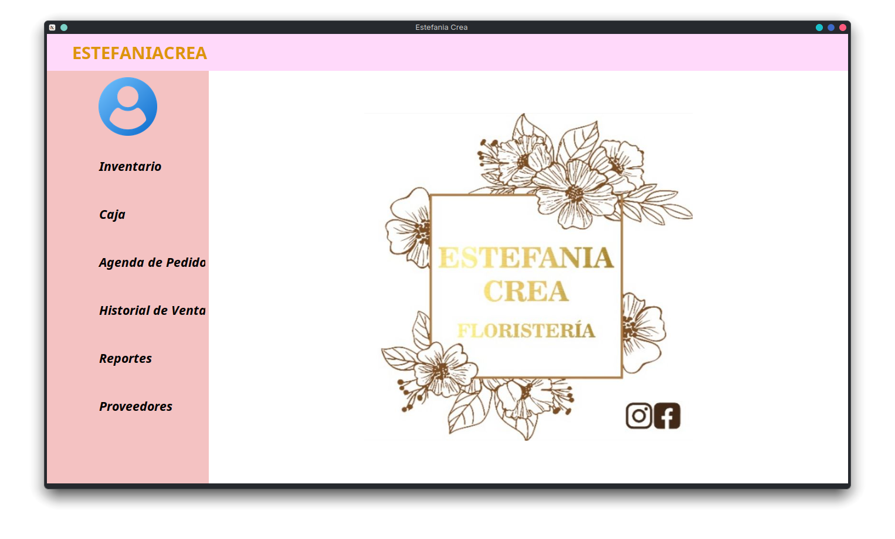
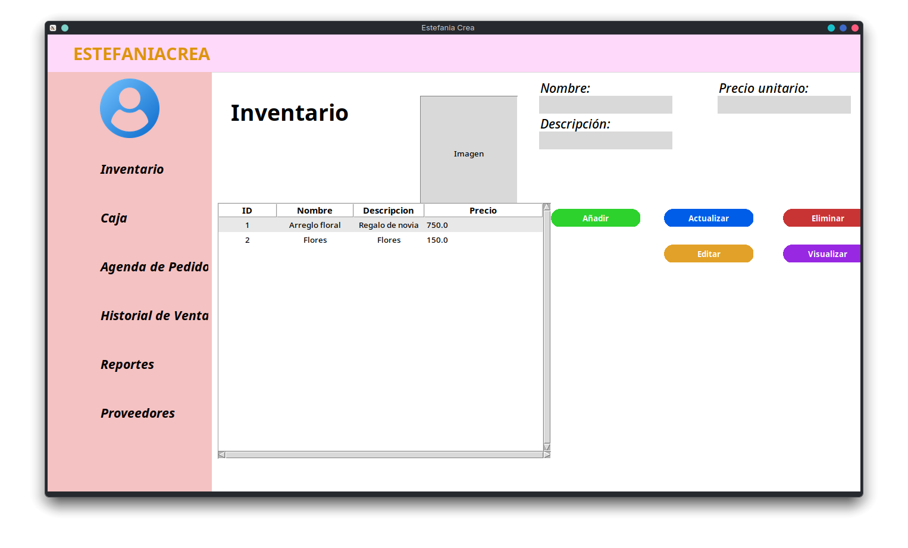
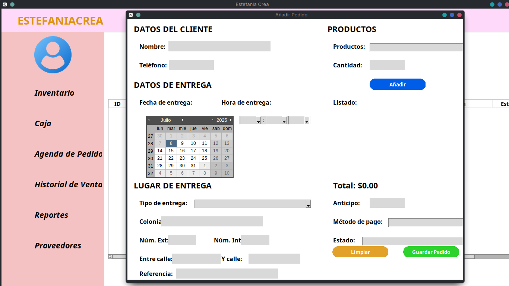

# 🌸 Florist Management — ESTEFANIACREA

Bienvenido al repositorio de **Florist Management**, una interfaz web de presentación diseñada para mostrar el sistema de gestión de floristerías **ESTEFANIACREA**. Este sitio tiene como objetivo ilustrar de manera clara, estética y funcional los beneficios del software.

---

## 📸 Vista previa





---

## 🚀 Características

- Página web responsiva, diseñada para visualizarse correctamente en dispositivos móviles y escritorio.
- Carrusel automático con capturas del sistema de escritorio.
- Sección "Historia" explicando el problema que resuelve el sistema.
- Enlace de descarga al documento PDF del proceso de desarrollo.
- Diseño visual armonioso con paleta de colores cálida y tipografías modernas.

---

## 🛠️ Tecnologías usadas

- **HTML5** y **CSS3** puro (sin frameworks).
- **Google Fonts**: Montserrat y Fira Mono.
- **Animaciones CSS**: para carrusel de imágenes.
- **Diseño responsive**: mediante media queries.

---

## 📂 Estructura del proyecto

```
Florist-Web/
│
├── assets/                # Imágenes y PDF de presentación
│   ├── EC-Inicio.png
│   ├── EC-LogIn.png
│   ├── EC-Inv.png
│   ├── EC-Agendar.png
│   └── JynxCode.pdf
│
├── index.html             # Página principal
├── style.css              # Estilos personalizados
└── README.md              # Este archivo
```

---

## 📥 Cómo usar

1. Clona el repositorio:
   ```bash
   git clone https://github.com/SaidPR/Florist-Web.git
   ```
2. Abre `index.html` en tu navegador favorito.
3. Asegúrate de tener acceso a la carpeta `assets/` para visualizar correctamente las imágenes.

---

## 📝 Nota

Este proyecto es una **demostración visual** del sistema y no incluye funcionalidades backend ni bases de datos. El software completo está disponible en otro repositorio o por solicitud directa.

---

## 👤 Autor

Desarrollado por **Said Piñones**  
📧 ramoszaid5@gmail.com

---
